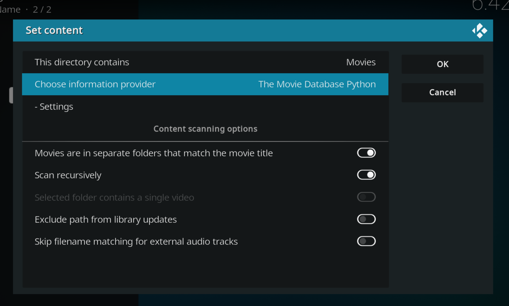
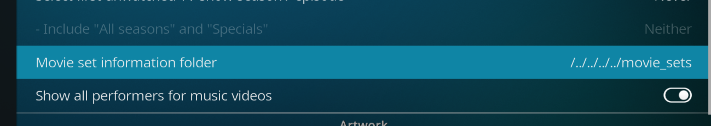

# Movie Sets

| Key               | Value            |
|:------------------|:-----------------|
| __Type__          | Feature          |
| __State__         | Concept          |
| __Last Updated__  | 2021-04-27       |

------------------------------------------------------

__Short description__:  
Movie sets (a.k.a. collections) bundle a group a movies.
These collections can have names, images and more meta data.

------------------------------------------------------

## Table Of Contents

 1. [Feature Description](#description)
 2. [Current State](#current-state)
 3. [Kodi Movie Sets](#kodi-movie-sets)
 4. [Planned Implementation](#planned)

## Description

Movie sets (also called movie collections) allow users to group movies.
These collections can be used by Kodi to enrich the media database with more content.
Images, titles, descriptions and more can be used to describe a movie set.

Especially images for movie sets are a feature that users asked about more often in the past few months.

_Examples:_

- __Harry Potter Collection__  
  TMDb: <https://www.themoviedb.org/collection/1241?language=en>  
  Movies: 8
- __Lord of the Rings Collection__  
  TMDb: <https://www.themoviedb.org/collection/119?language=en>  
  Movies: 3

MediaElch does support movie sets.  However, this feature is limited and the
defaults are not intuitive.

This concept file wants to show the current state and what we can do to improve
support for movie collections in MediaElch.

_Note:_  TMDb calls movie sets "movie collections".  However, in Kodi they are
"movie sets".  That's why MediaElch sticks to "movie sets" as well.

## Current State

To understand how MediaElch currently works, we use the first four "Harry Potter" as an example:

```
Harry Potter and the Chamber of Secrets (2002)
Harry Potter and the Goblet of Fire (2005)
Harry Potter and the Philosopher's Stone (2001)
Harry Potter and the Prisoner of Azkaban (2004)
```

### "Single Folders" Setup

TODO

### "Separate Folders" Setup

Assume that each movie has its own folder.  Each folder contains a file `movie.mov`.

## Kodi Movie Sets

Let's see how Kodi does it.  We use the same movies from the previous section.
We add the "movies" directory to Kodi with these settings:



Kodi loads all posters, banners, fanart and more. Not just for movies but for collections as well.
To be able to export all of that, we need to add a [set information folder][kodi_set_info_folder].



After exporting everything into separate files, the folder structure of `movies` looks like this:

```
.
├── Harry Potter and the Chamber of Secrets (2002)
│   ├── .actors
│   │   ├── Alan_Rickman.jpg
│   │   ├── ...
│   │   └── Warwick_Davis.jpg
│   ├── movie-fanart.jpg
│   ├── movie-poster.jpg
│   ├── movie.mov
│   └── movie.nfo
├── ...
└── Harry Potter and the Prisoner of Azkaban (2004)
    ├── .actors
    │   ├── Adrian_Rawlins.jpg
    │   ├── ...
    │   └── Warwick_Davis.jpg
    ├── movie-fanart.jpg
    ├── movie-poster.jpg
    ├── movie.mov
    └── movie.nfo
```

Each movie has an NFO file, fanart, poster and an actors directory.

If we have a look at the artworks directory, we see the following structure:

```
.
└── Harry\ Potter\ Collection
    ├── banner.jpg
    ├── clearart.png
    ├── clearlogo.png
    ├── discart.png
    ├── fanart.jpg
    └── poster.jpg
```

Pretty straightforward.  No `<basename>` or similar.

Each movie's `movie.nfo` contains the same text:

```xml
<set>
    <name>Harry Potter Collection</name>
    <overview>The Harry Potter films are a fantasy series based on the series of seven Harry Potter novels by British writer J. K. Rowling.</overview>
</set>
```

Therefore, all details about the set are duplicated.


## Planned

We plan to support [Kodi's movie set features][kodi_movie_sets].


[kodi_movie_sets]: https://kodi.wiki/view/Movie_sets
[kodi_set_info_folder]: https://kodi.wiki/view/Movie_set_information_folder